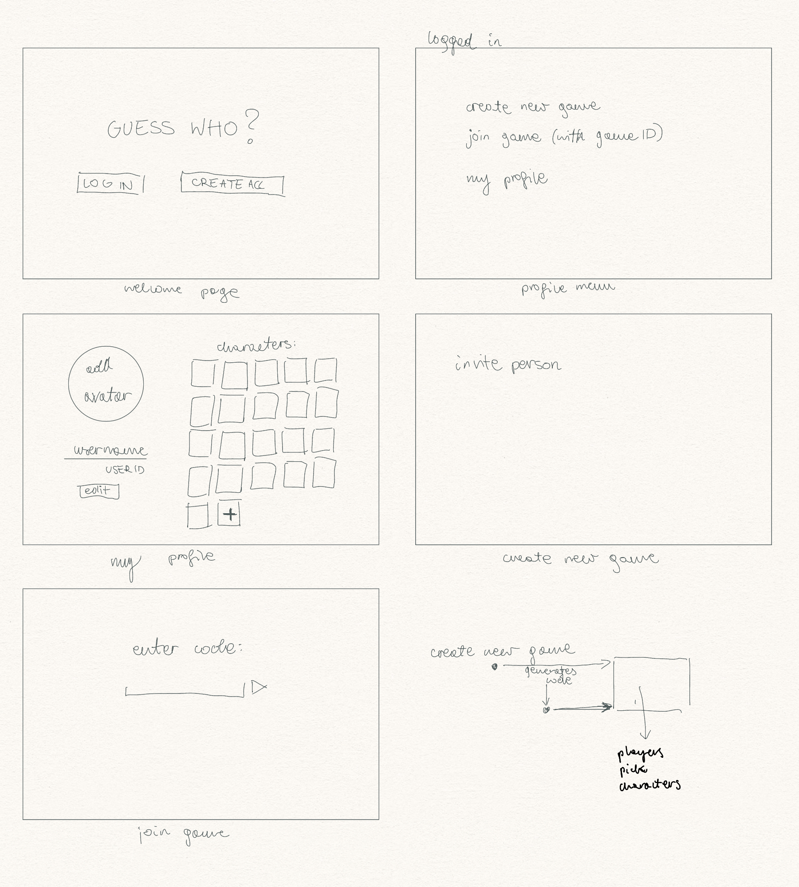

# Guess Who
A customizable digital Guess Who game, featuring unique user profiles and a dynamic list of characters - a reimagination of the classic board game.

### Tech stack
* **React & Next.js** - reactive UI and efficient rendering for smooth app performance
* **Firebase** - secure data handling, easy authentication, real-time database for storing user and game information

### Profile setup
Users can create personalized profiles, with an option to sign up using Google. Profiles enable players to save their favorite character sets, track game history, and connect with other players.

### Course of the game
The game begins when one player creates a session, generating a unique code that another player uses to join. Both players then collaborate to select characters, drawn from the intersection of their known characters. New characters can also be added to their lists at this stage. Once the character set is agreed upon, the game proceeds in the traditional Guess Who fashion, involving strategic questioning, character elimination, and the final guesses.

## TODO list
-  [x] initialize firebase
-  [x] pages and routing
-  [ ] static components and layout
    1. character gallery
    2. game prep view (layout + confirm button)
    3. game view (layout, buttons)
-  [ ] firebase authentication
-  [ ] dynamic content and firebase integration
    1. user profiles (store and retrieve in firebase)
    2. character management (add and display characters from firebase, incuding their photos)
    3. game code generation
-  [ ] advanced game logic
    1. joining a game with the code
    2. ‘game prep’ logic
    3. real time updates
-  [ ] enhancements and testing
    1. UI/UX - based on feedback
    2. different devices
-  [ ] final
    1. ensure data protection, other firebase aspects
    2. additional: score tracking, timers
    3. deployment  

### Sketch of the planned layout

